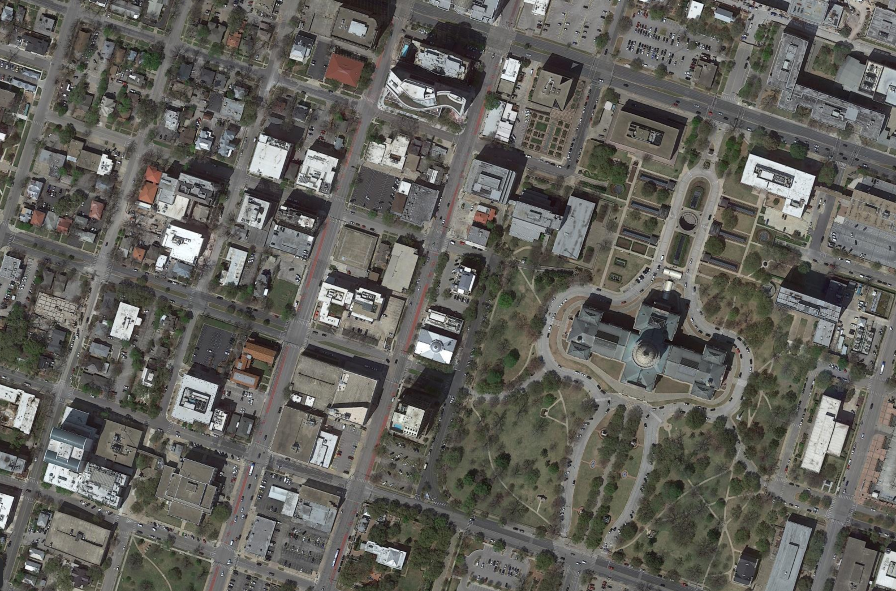
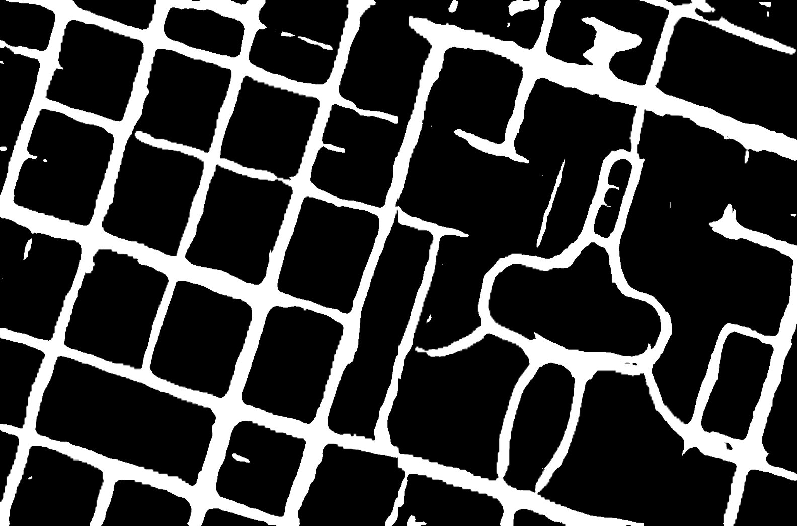
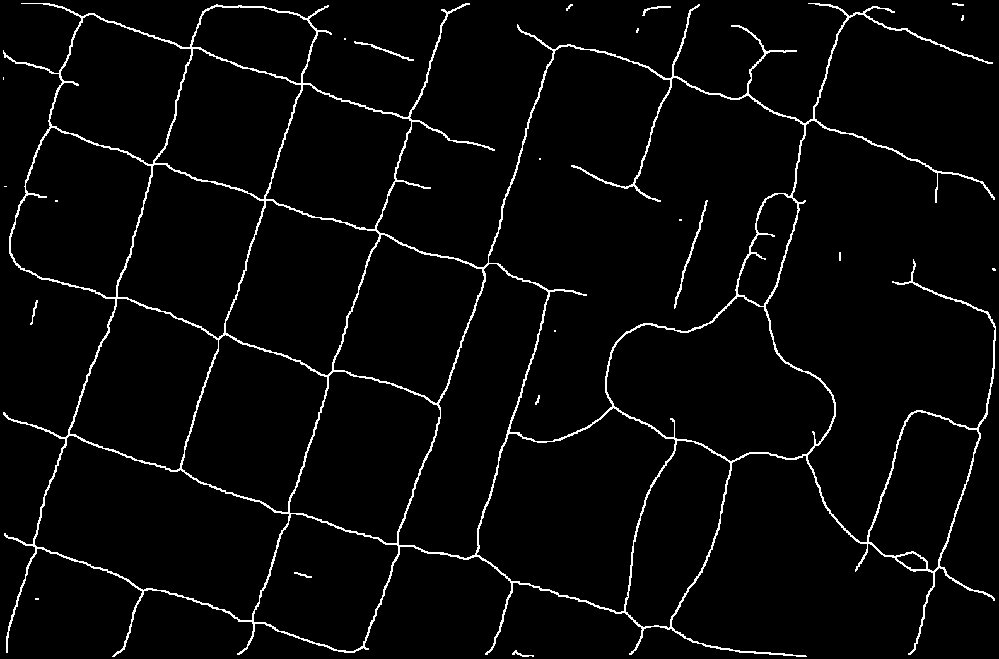
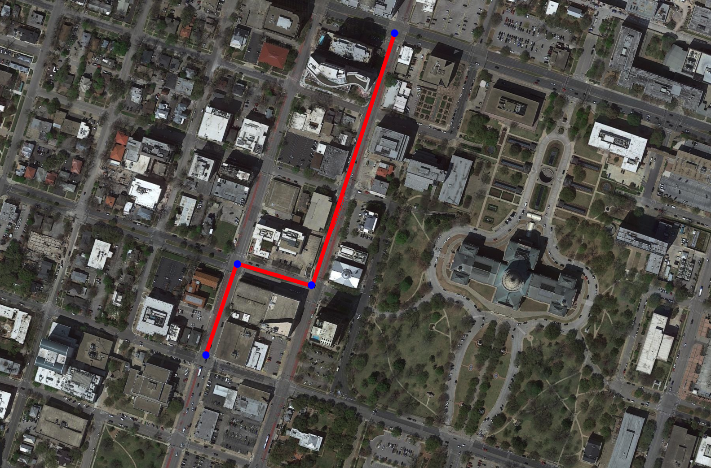
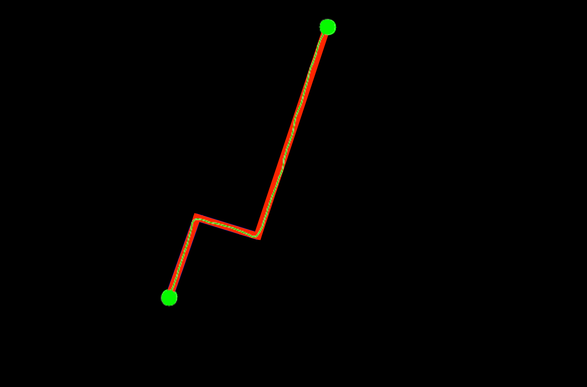
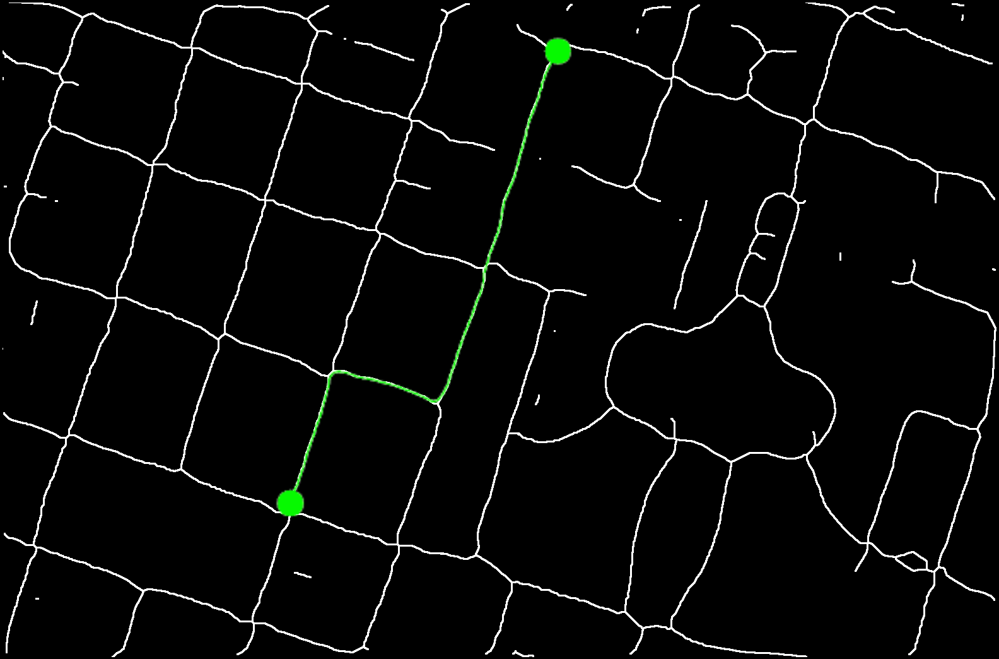

# Path Planning from Satellite Images

## Training Data
Two open access geospatial imaging datasets have been used to train the segmentation models:
1. Massachusetts Roads Dataset
    - 1438 images with masks
    - 1500x1500 resolution
    - Urban terrain
2. DeepGlobe Road Extraction Dataset
    - 6226 images with masks
    - 1024x1024 resolution
    - Semi-Urban & Rural terrain

## Model Architecture
Two models have been used to train on respective datasets, imported from `segmentation_models_pytorch`:
1. UNet
    - Encoder: ResNet-34 pretrained on imagenet
    - Activation : Sigmoid
    - Loss fn : DiceLoss , Optimizer : Adam(lr=4e-5)
    - Batch Size : 16, epochs : 6
    - Dataset : Massachusetts
2. DeepLabV3+
    - Encoder : ResNet-50 pretrained on imagenet
    - Activation : Sigmoid
    - Loss fn : DiceLoss , Optimizer : Adam(lr=8e-5)
    - Batch Size : 4, epochs : 4
    - Dataset : DeepGlobe

## Algorithms
1. Image Processing
    - opening : erosion + dilation 
    - closing : dilation + erosion
    - Skeletonize (scikit-image)
2. Route Finding
    - BFS : considering adjacent pixels of same color as connected
    - Dijkstra : using [0.1*d + sum{(c1-c2)^2}] as weights of edges followed by pruning of redundant nodes
    - A* : using a heuristic that underestimates the distance to the goal

## Workflow

<table style="margin: 0 auto;">
  <tr>
    <td>
        
        
 Input Satellite Image 

    </td>
    <td style="font-size: 32px; text-align: center; vertical-align: middle;">&rarr;</td>
    <td>
        
        
 Generate Road Mask 

    </td>
    <td style="font-size: 32px; text-align: center; vertical-align: middle;">&rarr;</td>
    <td>
        
        
 Skeletonize Road Map 

    </td>
  </tr>
  <tr>
    <td> </td>
    <td> </td>
    <td> </td>
    <td> </td>
    <td style="font-size: 32px; text-align: center; vertical-align: middle;">&darr;</td>
  </tr>
  <tr>
    <td>
        
        
 Shortest Road Path 

    </td>
    <td style="font-size: 32px; text-align: center; vertical-align: middle;">&larr;</td>
    <td>
        
        
 Prune & Smoothen Path 

    </td>
    <td style="font-size: 32px; text-align: center; vertical-align: middle;">&larr;</td>
    <td>
        
        
 Find Shortest Path 

    </td>
  </tr>
</table>